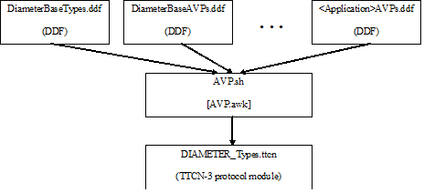
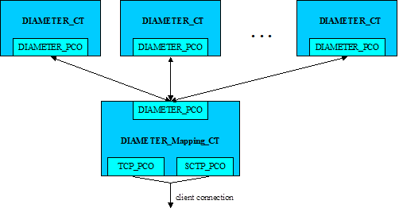
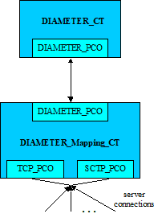

= DIAMETER Protocol Module Generator for TTCN-3 Toolset with TITAN, Function Description
:author: Tímea Moder
:revnumber: 1551-CNL 113 462, Rev. AG
:revdate: 2018-06-01
:toc:

== About This Document

=== How to Read This Document

This is the Function Description for the DIAMETER Protocol Module Generator. The DIAMETER Protocol Module Generator is developed for the TTCN-3 Toolset with TITAN.

=== Presumed Knowledge

To use this protocol module the knowledge of the TTCN-3 language <<_1, [1]>> is essential.

Basic knowledge of the Diameter protocol <<_3, [3]>> is valuable to use this protocol module.

= General Overview

== Background

Former solution for testing Diameter applications is based on the Diameter Test Port. This test port implies a number of limitations:

1. AVPs and other application-specific data are hard-coded in the Test Port, which makes the extension hard. New AVPs need to be added, encoded and decoded manually.

2. The support of different revisions of same Diameter application is required by different projects. Different revisions may contain, for example, overlapping AVP codes or other contradictory type definitions, which can only be handled using run-time switches.

DPMG provides solution to this problem by dynamically generating the type definition module containing the AVPs and definitions of the chosen applications.

The generated protocol module implements the message structures of the Diameter protocol in a formalized way, using the standard specification language TTCN-3. This allows defining of test data (templates) in the TTCN-3 language <<_1, [1]>> and correctly encoding/decoding messages when executing test suites using the Titan TTCN-3 test environment.

The protocol module uses either the Titan’s RAW encoding attributes <<_2, [2]>> for Diameter encoder or the generated speed optimized C++ encoder and hence is usable with the Titan test toolset only.

== Overview

Protocol modules implement the message structure of the related protocol in a formalized way, using the standard specification language TTCN-3. This allows defining of test data (templates) in the TTCN-3 language <<_1, [1]>> and correctly encoding/decoding messages when executing test suites using the Titan TTCN-3 test environment.

See the DPMG Architecture below:

[[DPMG_Architecture]]

= Functionality

The DIAMETER protocol module (for example, __DIAMETER_Types.ttcn__) is generated dynamically from the input DDF files using a shell script, which performs this with the help of an AWK script (<<DPMG_Architecture, DPMG Architecture>>).

The naming of DDFs should follow the `<Official-Vendor-Id><Official-Application-Name>AVPs_<Application-Version>` scheme. The extension MUST NOT be _.ttcn_; _.ddf_ is recommended.

If the application uses only a minor sub-set of some standard specification then it is acceptable to define these AVPs in the framework of the new application instead of including all unnecessary AVPs of the standard.

The type definitions for testing protocols comply the Diameter Base Specification are split in two DDFs:

[width="100%",cols="40%,50%",options="header",]
|===========================================================================
|DDF name |Contents
|`BaseTypes_IETF_RFC3588` |Diameter Base Protocol <<_3, [3]>> related type definitions
|`Base_IETF_RFC3588` |Diameter Base Protocol <<_3, [3]>> AVP type definitions
|===========================================================================

The `AVP.awk` script merges its argument DDFs into a single valid TTCN-3 module called `DIAMETER_Types` by default.

The input DDFs must comply with the naming and typographical conventions described herein in order for the `AVP.sh` script to produce a syntactically and semantically valid TTCN-3 module.

== Naming Conventions

The generated identifiers of types are based on information provided in comments within the DDFs themselves.

1. Applications are distinguished using the unique `<Application-Name>` and `<Application-Revision>`, which are assigned by TCC. The `<Application-Name>` is used to prefix type as well as certain field identifiers in the generated TTCN-3 module to ensure unique naming. The `<Application-Revision>` is only optionally used in prefixes. The `<Application-Name>` and `<Application-Revision>` are hard-coded in each TTCN-3 FILE using the following format:
+
[source]
----
// APPLICATION-NAME: NASREQ

// APPLICATION-REVISION: Draft17
----

2. AVP properties (e.g. name, code, vendor-id) are enlisted in C++ style comment right before the AVP type definition using the following format:
+
[source]
----
// AVP: <Official-AVP-Name> (<Official-AVP-Code>) <Official-Vendor-Id> (<Official-Vendor-Id-Code>)

type Type_Specifier Official_AVP_Name …
----

3. The entire comment line with the information MUST stand in the same line (no line breaks when it splits to multiple lines).

4. The TTCN-3 type definition following a properly formed comment line is interpreted as an AVP definition, if the type identifier matches the `<Official-AVP-Code>` appearing in the comment before.

5. The `<Official-AVP-Name>`, `<Official-AVP-Code>`, `<Official-Vendor-Id>` and `<Official-Vendor-Id-Code>` shall come from the relevant RFC, IETF Draft or other specification.

6. The `<Official-Vendor-Id>` and `<Official-Vendor-Id-Code>` must be omitted if V bit is not set (i.e. `<Official-AVP-Name>` and `<Official-AVP-Code>` are unique)!

7. The TTCN-3 identifiers used in `<Official-AVP-Name>` and `<Official-Vendor-Id>` must keep the original naming except when this collides with TTCN-3 identifier’s naming rules:
+
[loweralpha]

a. Hyphens and spaces must be replaced by a single underscore

b. Trailing `AVP` SHOULD be omitted if not part of the name

8. The `<Official-AVP-Code>` and `<Official-Vendor-Id-Code>` must be given as integer numbers!

=== Key to Unique Naming of Identifiers

The following uniqueness criteria – derived from Diameter <<_3, [3]>> – must hold for identifiers used in DDFs:

1.  `<Application-Name>` or `<Application-Revision>` MAY NOT be globally unique.
2.  `<Application-Name>` AND `<Application-Revision>` MUST be globally unique: +
Each application identifier must be formulated so that it is always unique. It can happen that different drafts of the same application are used together that is why it is strongly recommended to prefix with `<Application-Revision>`, too!
+
Example 1
+
[source]
<Application-Name>s: BASE, NASREQ
+
Example 2
+
[source]
<Application-Revision>s: RFC3588, Draft17Combined prefixes: BASE_RFC3588, NASREQ_Draft17

3.  `<Official-AVP-Name>` may not be unique: +
It happens that the same AVP name is used in the same or in different Diameter applications. The script is designed to cope with this, thus it is recommended to keep the standard AVP name with respect to naming conventions.
+
Example
+
[source]
<Official-AVP-Name>s: Multi_Round_Time_Out

4.  `<Official-AVP-Code>` AND `<Official-Vendor-Id>` MUST be globally unique (except within different revisions of the same application!) since these two 32Bits numbers determine the AVP.
5.  `<Official-AVP-Name>` AND `<Official-Vendor-Id>` MUST be unique within an application
6.  `<Application-Name>` AND `<Official-AVP-Name>` AND `<Official-Vendor-Id>` MUST be globally unique

=== How to Model Enumeration Type AVPs in DDFs?

It is important to ensure the unique naming of enumeration type identifiers and enumeration items. Each enumerated type AVP requires a single type definition: The enumerated type definition containing the valid enumeration items. The identifier of the enumeration type shall be `<Official-AVP-Name>`.

The `AVP.sh` script generates Unsigned32 type AVP for each enumerated type AVP when the `enum_2_Unsigned32` option is turned on.

All enumerations in DDFs will get the following attributes automatically assigned to enumeration type AVPs' enumerations:

[source]
----
with {
variant "FIELDLENGTH(32)"
variant "BYTEORDER(last)"
variant "COMP(2scompl)"
}
----

`Command_Code` enumeration type can be extended in Diameter applications. DPMG merges them together into a single type definition with proper attributes. Duplicates are removed when some enumeration items appear multiple times within `Command_Code` definitions of the input DDF files.

== Script Operation

The TTCN-3 module, containing all relevant type definitions, is generated automatically from the relevant DDFs by a script. This ensures that no collision can appear between proper Diameter applications.

The top-level Diameter PDU to send/receive is always `PDU_DIAMETER`.

=== Load and Parse All Input Files

If overlapping AVP codes (same AVP code and Vendor-Id) are found during parsing of DDFs then the created TTCN-3 module (for example, `DIAMETER_Types`) will contain only the AVP found first. (This can happen when trying to use many different or identical revisions of the same Diameter application.)

=== Type Identifiers

The script changes AVP type identifiers in order to avoid name collisions. The `<Official-Application-Name>` (and optionally the `<Official-Application-Revision>`) and `<Official-Vendor-Id>` will prefix the `Official_AVP_Name` defined in DDF.

Example of AVP type definition in DDF:

[source]
----
// RFC 3588 8.14
// AVP: User-Name (1)
type AVP_UTF8String User_Name;
----

The corresponding type definition in the generated module (no Vendor-Id is allowed for User-Name AVP of Diameter Base specification `(<Application-Name>=BASE))`:

[source]
----
// AVP: User-Name (1)
type AVP_UTF8String BASE_NONE_User_Name;
----

If the `<Official-AVP-Name>` begins with `<Official-Vendor-Id>` then it is recommended to remove this from the `<Official-AVP-Name>` as the `<Official-Vendor-Id>` is always used to prefix AVP type definitions!

When the `<Vendor-Id>` of `<Official-AVP-Name>` is in category MUST NOT, then the `<Vendor-Id>` MUST NOT appear in the AVP comment line. `_"NONE"_` is used in the identifier of the generated AVP type definition when `<Official-Vendor-Id>` is absent.

[[vendor-id]]
=== `Vendor_Id`

Create `Vendor_Id` enumerated type containing all vendor ids that were found in the comment fields. The `Vendor_Id` type shall be used to determine the valid AVP code set (`AVP_Code_<Application-Name>_<Official-Vendor-Id>`) in the `AVP_Code` union.

[source]
----
type enumerated Vendor_Id {
	// for each vendor id found in FILEs
	vendor_id_<Official-Vendor-Id> (<Official-Vendor-Id-Code>)
} with {
	variant "FIELDLENGTH(32)"
	variant "BYTEORDER(last)"
	variant "COMP(2scompl)"
}
----

The `Vendor_Id` codes are assigned by IANA according to ASSIGNNO [RFC3232], which is now obsoleted by an on-line database at http://www.iana.org/assignments/enterprise-numbers. The database contains over 23000 entries thus using a predefined `Vendor_Id` type is not appropriate!

NOTE: This `Vendor_Id` type will not clash with the Vendor-Id AVP of Diameter base specification as the AWK script alters the identifier of the latter type definition!

[[avp-code-official-vendor-id]]
=== `AVP_Code_<Official-Vendor-Id>`

Putting all AVP codes into a single enumerated type does not work because `<Official-AVP-Code>` is not globally unique. We can create unique identifiers for enumeration items but some enumeration items could have the same numeric value assigned, which is forbidden in TTCN-3. Separate `AVP_Code_<Official-Vendor-Id>` enumerations have to be created for each found Vendor-Id. The enumeration items themselves will be the AVP names prefixed with `avp_code_`, `<Application-Name>` and `<Official-Vendor-Id>`!

[source]
----
type enumerated AVP_Code_<Official-Vendor-Id> {
	avp_code_<Application-Name>_<Official-AVP-Name>
(<Official-AVP-Code>)
} with {
	variant "FIELDLENGTH(32)"
	variant "BYTEORDER(last)"
	variant "COMP(2scompl)"
}
----

For those AVPs where the `<Official-Vendor-Id>` MUST NOT be present, `_"NONE"_` shall be used as prefix!

[[avp-code]]
=== `AVP_Code`

The `AVP_Code` itself is a union type consisting of the `AVP_Code_<Official-Vendor-Id>` enumerations.

[source]
----
type union AVP_Code {
	// for each vendor id found in DDFs
	AVP_Code_<Official-Vendor-Id> vendor_id_<Official-Vendor-Id>
}
----

[[avp-header]]
=== *__AVP_Header__*

The *__AVP_Header__* type must be generated because the RAW attributes must be inserted for correct decoding of `AVP_Code` union.

[source]
----
type record AVP_Header {
	AVP_Code	avp_code,
	BIT8		VMPxxxxx,
	UINT24		avp_length,
	Vendor_Id	vendor_id	optional
} with {
	variant (vendor_id) "PRESENCE( {
		VMPxxxxx = '10000000'B,
		VMPxxxxx = '10100000'B,
		VMPxxxxx = '11000000'B,
		VMPxxxxx = '11100000'B
} )"
	variant (avp_code) "CROSSTAG(
		// for all AVP_Code union members
		vendor_id_<Official-Vendor-Id>,
vendor_id = vendor_id_<Official-Vendor-Id>;
	)"
}
----

For proper decoding it is important to set the spare bits to zero as required by the Diameter base specification <<_3, [3]>>.

[[avp-data]]
=== `AVP_Data`

The `AVP_Data` type is a generated union type containing all AVP types found in the DDFs:

[source]
----
type union AVP_Data {
	<Application-Name>_<Official-Vendor-Id>_<Official-AVP-Name>
		avp_<Application-Name>_<Official-Vendor-Id>_<Official-AVP-Name>,
	octetstring	avp_UNKNOWN
}
----

`avp_UNKNOWN` contains the erroneous AVP when something went wrong during the decoding of the AVP data.

=== AVP

The AVP type is a record that consists of two fields: the header `avp_header` and the data `avp_data`.

[source]
----
type record AVP {
  AVP_Header avp_header,
  AVP_Data avp_data
} with {
  variant "PADDING(dword32)"
  variant (avp_header) "LENGTHTO(avp_header, avp_data)"
  variant (avp_header) "LENGTHINDEX(avp_length)"
  variant (avp_data) "CROSSTAG(
		// for all union fields
		avp_<Application-Name>_<Official-Vendor-Id>_<Official-AVP-Name>,
		avp_header.avp_code.vendor_id_<Official-Vendor-Id> =
		avp_code_<Application-Name>_<Official-AVP-Name>;
		// last entry
		avp_UNKNOWN, OTHERWISE
	)"
}
----

=== `GenericAVP`

The `GenericAVP` type is a union that was defined for error handling purposes.

[source]
----
type union GenericAVP {
  AVP avp,
  octetstring avp_UNKNOWN
}
----

The `avp` field contains an AVP if it was correctly decoded, while the `avp_UNKNOWN` will contain the erroneous AVP with the header when something went wrong during the decoding.

[[command-code]]
=== `Command_Code`

`Command_Code` enumeration type is merged together from the DDF file of different application’s `Command_Code` definition by the AWK script. All enumeration item defined in different application are collected together and written to the generated __DIAMETER_Types.ttcn__ file. Proper encoding attributes are added to the `Command_Code` type by the script.

=== Output TTCN-3 Module

All definitions of DDF files, which are not subject to change are written to the output TTCN-3 module (for example, __DIAMETER_Types.ttcn__) file as is.

[[output-encoder-decoder]]
=== Output Encoder/Decoder

Optionally it is possible to generate a speed optimized __DIAMETER_EncDec.cc__ encoder/decoder instead of the RAW encoder and the default __DIAMETER_EncDec.cc__.

=== Detailed VMP and RPET Bits

The type definition of the RPET bits of the `Diameter` header and the VMP bits of the `AVP` header can be:

* 8 bit wide bitfield (BIT8) (traditional representation)

* Every bit is represented as a single bit (BIT1)

The handlings of these bits are controlled by the parameter of the generator script.

=== Bigint Support for Unsigned32 and 64 Bit Integer

The 32 bit unsigned integer and 64bit integer types can be represented as:

* 4 or 8 octet long octetstring

* integer

The used type is controlled by the parameter of the generator script.

== Backward Incompatibilities

[[back_cxdxinterface-ericsson-1551-fay301-0059-pc26-ddf]]
=== __CxDxInterface_Ericsson_1551_FAY301_0059_PC26.ddf__

Until version R24B The ddf file contained duplicated AVPs with __Ericsson_Specific_AVPs.ddf__. In version R24C, these duplications were removed and the prefix of the AVPs was chaged from `ECX_` to `E_`. This change is not backward compatible.

== System Requirements

The `DIAMETER` protocol module generator consist of several DDF files, contains different application definitions of Diameter protocols, a `GNU AWK` and shell script which reads the DDF files and generates the type definition module (__DIAMETER_Types.ttcn__ by default).

Protocol modules are a set of TTCN-3 source code files that can be used as part of TTCN-3 test suites only. Hence, protocol modules alone do not put specific requirements on the system used. However in order to compile and execute a TTCN-3 test suite using the set of protocol modules the following system requirements must be satisfied:

* TITAN TTCN-3 Test Executor R7A (1.7.pl0) or higher installed. For installation guide see <<_2, [2]>>.

NOTE: This version of the protocol module is not compatible with TITAN releases earlier than R7A.

== Installation

The set of protocol modules can be used for developing TTCN-3 test suites using any text editor. However, to make the work more efficient a TTCN-3-enabled text editor is recommended (for example, `nedit`, `xemacs`). Since the Diameter protocol is used as a part of a TTCN-3 test suite, this requires Titan TTCN-3 Test Executor be installed before the module can be compiled and executed together with other parts of the test suite. For more details on the installation of TTCN-3 Test Executor see the relevant section of <<_2, [2]>>.

The `AVP.sh` shell script runs on Bourne Shell, which is usually available on a all UNIX like workstations. The `AVP.awk` script, which processes the DDF files and creates the DIAMETER protocol module, can be executed with `GNU AWK` version 3.1.6 or later <<_4, [4]>> so it must be available on the system.

[[generation-of-the-diameter-types-ttcn]]
== Generation of the ___5DIAMETER_Types.ttcn_5__

First you need to obtain the required DDF files. After you have the DDF files containing the definitions of the selected Diameter applications, you can generate the proper Diameter type definitions module by issuing for example the following command:

[source]
AVP.sh DiameterBaseAVPs.ddf DiameterBaseTypes.ddf OtherApplications.ddf

The above command generates the TTCN-3 type definition by merging the content of DDF files into module `DIAMETER_Types` into file __DIAMETER_Types.ttcn__. The script filters out duplicate AVP definitions by placing only the first one into the generated TTCN-3 module. Skipped definitions are annotated with warnings.

The script can be optionally invoked with some options. The options modify script operation. The options must appear in the argument list before the DDF files. Each option is introduced with the `–v` flag. The options must not immediately follow the `–v` flag; whitespace separation is required. The options themselves must be written in one word.

=== Supported Options

The supported options are:

* `module_id`: +
This option can be used to alter the identifier of generated TTCN-3 module. The `module_id` shall be a valid TTCN-3 identifier but must not contain underscore.

* `use_application_revision`: +
This option results the application revision string to be added as prefix to generated identifiers. The application revision string is hardcoded into the input DDF files. This option is disabled by default.

`use_bigint`: +
This option makes the script to use integer for UINT32, INT64 and UINT64 types instead of octetstring. This option is disabled by default.

`detailed_bits`: +
This option makes the script to generate detailed type definition for VMP and RPET bits. This option is disabled by default.

`disable_prefix`: +
This option makes the script to generate identifier names and a fixed `"AVP"` prefix instead of using the application name specified in the ddf file. This option is disabled by default.

`enum_2_Unsigned32_list=<list file name>`: +
This option makes the script to generate the listed AVP as Unsigned32 instead of enumerated type.

`custom_enc`: +
This option makes the script to generate c++ encoder/decoder function instead of using the RAW encoder. This function generates a complete new __DIAMETER_EncDec.cc__.

`use_UTF8_encoding`: +
This option defines AVP_UTF8String as universal charstring which will be encoded in UTF-8. This option can be used only together with `custom_enc`.

The next command stores the generated TTCN-3 definitions in module XYZ and translates all enumeration type AVPs to Unsigned32:

[source]
AVP.sh –v module_id=XYZ –v enum_2_Unsigned32=true DiameterBaseAVPs.ddf DiameterBaseTypes.ddf _OtherApplications.ddf_

NOTE: `AVP.sh` requires `AVP.awk` and – in case of specifying the `module_id` option – the __DIAMETER_EncDec.cc__ C++ source file for its operation!

The next command stores the generated TTCN-3 definitions in module XYZ, generates a __DIAMETER_EncDec.cc__ and `AVP_UTF8String` will be defined as universal charstring encoded as UTF-8.

[source]
----
AVP.sh –v module_id=XYZ –v custom_enc=DIAMETER_EncDec.cc -v use_UTF8_encoding=true DiameterBaseAVPs.ddf DiameterBaseTypes.ddf _OtherApplications.ddf_
----

=== ___Makefile___ Preparation

In case you want to add the task of generation of __DIAMETER_Types.ttcn__ module into your _Makefile_, you should do the following:

1. Generate the _GNU Makefile_ for your existing TTCN-3 and C++ files, except __DIAMETER_Types.ttcn__.

2. Add __DIAMETER_Types.ttcn__ manually to the list of the TTCN-3 sources into the generated _Makefile_.

3. Add the following rules to your _Makefile_:
+
[source]
----
DIAMETER_Types.ttcn: DiameterBaseTypes.ddf DiameterBaseAVPs.ddf <Input FILEs containing AVP definitions>

AVP.sh latexmath:[$(filter %.ddf,$]^)
----

When you use GUI for building executable, on top of normal project creation you should take care of the following:

1.  Add `AVP.awk` script and all DDF files you need to add to the `misc` files section.

NOTE: You must generate softlinks to the build directory with selecting the files and select 'Generate Softlinks' menu item manually as it is not generated automatically by the GUI.

2.  Create a script to modify the generated _Makefile_. List all the DDF files you need when executing the `AWK` script.
3.  Add script to modify the _Makefile_ in the project properties.
4.  If you want to have the _DIAMETER_Types.ttcn_ file added to your project, you can, but after adding, you should exclude the file from build in order to avoid double occurrence in the _Makefile_.

== Helper Functions

Two separate external functions are available for generating End-to-End and a Hop-by-Hop identifiers:

[source]
external function f_DIAMETER_genHopByHop() return octetstring;

This function generates a 4 octet long Hop-by-Hop identifier. The values returned are based on random number generation.

[source]
external function f_DIAMETER_genEndToEnd() return octetstring;

The function above generates a 4 octet long End-to-End identifier according to <<_5, [5]>>. The high order 12 bits contain the low order 12 bits of current time, and the low order 20 bits contain a random value.

It is important to mention, that if the Hop-by-Hop-Identifier or the End-to-End-Identifier is set to `_"0"_`, the encoder function automatically generates a value with the help of the presented two functions.

One external function is available to acquire an AVP by AVP code from an encoded Diameter PDU.

[source]
----
external function f_DIAMETER_GetAVPByListOfCodes(in octetstring pl_oct, in integerList pl_codeList) return octetstring;
----

The function accepts a list of AVP codes and will return the octetstring AVP value of the first AVP in the encoded Diameter PDU whose AVP code is in the list. Providing multiple AVP codes can be useful if the same AVP type can appear in the message with different AVP codes (for example, public id).

[source]
----
external function f_DIAMETER_GetAVPByListOfCodesCombined(in octetstring pl_oct, in integerList pl_codeList,in integerList pl_groupcodeList) return octetstring;
----

The purpose of this function is the same as the `f_DIAMETER_GetAVPByListOfCodes`, except `f_DIAMETER_GetAVPByListOfCodesCombined` searches also within the grouped AVPs listed in the `pl_groupcodeList` list.

[[encoding-decoding-functions]]
== Encoding/Decoding Functions

This product also contains encoding/decoding functions that assure correct encoding of messages when sent from Titan and correct decoding of messages when received by Titan. Implemented encoding/decoding functions:

[cols=3*, options=header]
|===

|Name
|Type of formal parameters
|Type of return

|`valuef_DIAMETER_Enc`
|(in PDU_DIAMETER pl_pdu)
|octetstring;

|`f_DIAMETER_Dec`
|(in octetstring pl_oct)
|PDU_DIAMETER;
|===

== Error Handling

During the decoding of a Diameter message the following error scenarios can be identified:

* If a Diameter message arrives with a command code not known by the Diameter protocol module, an error message is generated, where the unknown command code value appears at <value>:

[source]
----
Warning: While RAW-decoding type `@DIAMETER_Types.PDU_DIAMETER': Invalid enum value <value> for `@DIAMETER_Types.Command_Code'
----

* In case of an unknown AVP code, the AVP is decoded into a special `avp_UNKNOWN` field that contains the entire AVP with the header in its octetstring form. If the length of the AVP cannot be determined then the rest of the Diameter message is also put into this kind of AVP.
* If there is an AVP in the Diameter message, where the V bit is incorrectly set to `_"1"_`, but it doesn’t contain an optional Vendor-Id field, the decoder first tries to interpret the octets as a Vendor-Id and if it isn’t a known Vendor-Id value, then the decoder can detect it and sets this field to omit. The octets will be treated as data further on.
* In case there is an AVP in the Diameter message, where the V bit is incorrectly set to `_"0"_`, but it contains an optional Vendor-Id field, it is decoded into the special `avp_UNKNOWN` field.
* When an AVP appears with an unexpected Vendor-Id, it is decoded into the special `avp_UNKNOWN` field.

== Limitations

`<Application-Revision>` field in DDF files are not handled yet by the script. The reason is no application makes the `<Application-Revision>` info essential.

= Protocol Versions

== Product Contents and Structure

The major parts of DPMG are:

[loweralpha]

. `AVP.sh` script - This is the front-end of the protocol module generator.

. `AVP.awk` script - This is the most important part of the product.

. A pair of encoder and decoder functions to invoke RAW encoder/decoder or the generated encoder/decoder.

The Diameter Base Protocol <<_1, [1]>> and other Diameter applications are specified in DDFs developed by TCC as part of the DPMG product.

The TTCN-3 module that is generated by the script varies between applications, thus it is NOT a product.

== Protocol Version Implemented

Currently the following applications are supported:

[width="100%",cols="80%,20%",options="header"]
|=======================================================
|DDFs |Refs.
|__BaseTypes_IETF_RFC3588.ddf__ +
__Base_IETF_RFC3588.ddf__ |<<_3, [3]>>
|__CLCInterface_Vodafone_Rev2.ddf__ |<<_50, [50]>>
|__ChargingApplications_3GPP_TS32299_850.ddf__ |<<_24, [24]>>
|__ChargingApplications_3GPP_TS32299_870.ddf__ |<<_25, [25]>>
|__ChargingApplications_3GPP_TS32299_900.ddf__ |<<_26, [26]>>
|__ChargingApplications_3GPP_TS32299_940.ddf__ |<<_62, [62]>>
|__ChargingApplications_3GPP_TS32299_9b0.ddf__ |<<_63, [63]>>
|__ChargingApplications_3GPP_TS32299_a60.ddf__ |<<_63, [63]>>
|__ChargingApplications_3GPP_TS32299_c60.ddf__ |<<_102, [102]>>
|__ChargingApplications_3GPP_TS32299_d70.ddf__ |
|__ChargingApplications_3GPP_TS32299_be0.ddf__ |<<_104, [104]>>
|__ChargingApplications_3GPP_TS32299_d40.ddf__ |<<_103, [103]>>
|__CreditControl_IETF_RFC4006.ddf__ |<<_6, [6]>>
|__CxDxInterface_3GPP_TS29229_6a0.ddf__ |<<_27, [27]>>
|__CxDxInterface_3GPP_TS29229_840.ddf__ |<<_28, [28]>>
|__CxDxInterface_3GPP_TS29229_880.ddf__ |<<_29, [29]>>
|__CxDxInterface_3GPP_TS29229_920.ddf__ |<<_62, [62]>>
|__CxDxInterface_3GPP_TS29229_c30.ddf__ |<<_103, [103]>>
|__DigestAuthentication_IETF_RFC5090.ddf__ |<<_52, [52]>>
|__GiInterface_3GPP_TS29061_770.ddf__ |<<_32, [32]>>
|__GiSGiInterface_3GPP_TS29061_810.ddf__ |<<_33, [33]>>
|__GiSGiInterface_3GPP_TS29061_930.ddf__ |<<_61, [61]>>
|__GiSGiInterface_3GPP_TS29061_980.ddf__ |<<_34, [34]>>
|__GiSGiInterface_3GPP_TS29061_930_QoS_Detailed.ddf__ |<<_61, [61]>>
|__GiSGiInterface_3GPP_TS29061_b90.ddf__ |<<_105, [105]>>
|__GiSGiInterface_3GPP_TS29061_b90_QoS_Detailed.ddf__ |<<_105, [105]>>
|__GiSGiInterface_3GPP_TS29061_d70.ddf__ |<<_117, [117]>>
|__GmbInterface_3GPP_TS29061_6f0.ddf__ |<<_30, [30]>>
|__GmbInterface_3GPP_TS29061_720.ddf__ |<<_31, [31]>>
|__GmbInterface_3GPP_TS29061_810.ddf__ |<<_33, [33]>>
|__GmbInterface_3GPP_TS29061_930.ddf__ |<<_61, [61]>>
|__GmbInterface_3GPP_TS29061_970.ddf__ |<<_84, [84]>>
|__GmbInterface_3GPP_TS29061_980.ddf__ |<<_34, [34]>>
|__GmbInterface_3GPP_TS29061_d70.ddf__ |<<_117, [117]>>
|__GqInterface_PC_3GPP_TS29209_670.ddf__ |<<_19, [19]>>
|__GqInterface_S3_ETSI_TS183017_V231.ddf__ |<<_35, [35]>>
|__GxInterface_CRP_3GPP_TS29210_670.ddf__ |<<_18, [18]>>
|__GxInterface_PCC_3GPP_TS29212_740.ddf__ |<<_36, [36]>>
|__GxInterface_PCC_3GPP_TS29212_820.ddf__ |<<_37, [37]>>
|__GxInterface_PCC_3GPP_TS29212_830.ddf__ |<<_38, [38]>>
|__GxInterface_PCC_3GPP_TS29212_840.ddf__ |<<_39, [39]>>
|__GxInterface_PCC_3GPP_TS29212_910.ddf__ |<<_40, [40]>>
|__GxInterface_PCC_3GPP_TS29212_930.ddf__ |<<_60, [60]>>
|__GxInterface_PCC_3GPP_TS29212_970.ddf__ |<<_78, [78]>>
|__GxInterface_PCC_3GPP_TS29212_9b0.ddf__ |<<_78, [78]>>
|__GxInterface_PCC_3GPP_TS29212_d70.ddf__ |<<_112, [112]>>
|__GxInterface_PCC_3GPP_TS29212_f10.ddf__ |
|__NetworkAccessServer_IETF_RFC4005.ddf__ |<<_11, [11]>>
|__RxInterface_PCC_3GPP_TS29214_830.ddf__ |<<_42, [42]>>
|__RxInterface_PCC_3GPP_TS29214_990.ddf__ |<<_42, [42]>>
|__RxInterface_PCC_3GPP_TS29214_a70.ddf__ |<<_92, [92]>>
|__RxInterface_PCC_3GPP_TS29214_c10.ddf__ |<<_100, [100]>>
|__RxInterface_PCC_3GPP_TS29214_f20.ddf__ |
|__ShInterface_3GPP_TS29329_620.ddf__ |<<_43, [43]>>
|__ShInterface_3GPP_TS29329_750.ddf__ |<<_44, [44]>>
|__ShInterface_3GPP_TS29329_820.ddf__ |<<_45, [45]>>
|__ShInterface_3GPP_TS29329_a30.ddf__ |<<_79, [79]>>
|__ShInterface_3GPP_TS29329_a50.ddf__ |<<_99, [99]>>
|__SLgInterface_3GPP_TS29172_d10.ddf__ |<<_110, [110]>>
|__SLhInterface_3GPP_TS29173_d00.ddf__ |<<_111, [111]>>
|__Verizon_Specific_AVPs.ddf__ |<<_51, [51]>>
|__e2Interface_ETSI_ES283035_121.ddf__ |<<_53, [53]>>
|__e4Interface_ETSI_ES283034_220.ddf__ |<<_54, [54]>>
|__TCOM_Specific_AVPs.ddf__ |<<_55, [55]>>, <<_56, [56]>>
|__a4Interface_ETSI_ES183066_211.ddf__ |<<_57, [57]>>
|__NGN_NetworkAccesses_ETSI_ES183020_111.ddf__ |<<_58, [58]>>
|__a2Interface_ETSI_ES183059_1_211.ddf__ |<<_59, [59]>>
|__AAAInterface_3GPP_TS29273_840.ddf__ |<<_64, [64]>>, <<_65, [65]>>
|__AAAInterface_3GPP_TS29273_940.ddf__ |<<_66, [66]>>, <<_67, [67]>>
|__AAAInterface_3GPP_TS29273_b30.ddf__ |<<_90, [90]>>
|__AAAInterface_3GPP_TS29273_d60.ddf__ |
|__AAAInterface_3GPP_TS29273_f00.ddf__ |<<_122, [122]>>
|__MobileIPv6_NAS_IETF_RFC5447.ddf__ |<<_69, [69]>>
|__MobileIPv6_HA_IETF_RFC5778.ddf__ |<<_68, [68]>>
|__MobileIPv4_Application_IETF_RFC4004.ddf__ |<<_93, [93]>>
|__GmbInterface_3GPP_TS29061_930.ddf__ |<<_70, [70]>>
|__Ericsson_Specific_AVPs.ddf__ |<<_71, [71]>>
|__AAAInterface_3GPP_TS29272_940.ddf__ |<<_72, [72]>>
|__AAAInterface_3GPP_TS29272_950.ddf__ |<<_72, [72]>>
|__AAAInterface_3GPP_TS29272_970.ddf__ |<<_76, [76]>>
|__AAAInterface_3GPP_TS29272_a30.ddf__ |<<_83, [83]>>
|__AAAInterface_3GPP_TS29272_a60.ddf__ |<<_79, [79]>>
|__AAAInterface_3GPP_TS29272_d70.ddf__ |<<_113, [113]>>
|__AAAInterface_3GPP_TS29272_f10.ddf__ |<<_121, [121]>>
|__GxInterface_PCC_3GPP_TS29212_8a0.ddf__ |<<_74, [74]>>
|__GxInterface_PCC_3GPP_TS29212_8b1.ddf__ |<<_75, [75]>>
|__RqInterface_ETSI_ES283026_241.ddf__ |<<_77, [77]>>
|__Vimpelcom_Specific.ddf__ |
|__Vodafone_Specific.ddf__ |
|__ExtensibleAuthenticationProtocol_IETF_RFC4072.ddf__ |<<_81, [81]>>
|__AAAInterface_3GPP_TS29273.ddf__ |<<_79, [79]>>
|__WgInterface_3GPP_TS29234_910.ddf__ |<<_80, [80]>>
|__SGmbInterface_3GPP_TS29061_980.ddf__ |<<_34, [34]>>
|__SGmbInterface_3GPP_TS29061_b90.ddf__ |<<_105, [105]>>
|__SGmbInterface_3GPP_TS29061_d70.ddf__ |<<_117, [117]>>
|__GxaInterface_3GPP2_X_S0057_0_300.ddf__ |<<_85, [85]>>
|__Alcatel_Lucent_Specific_AVPs.ddf__ |<<_87, [87]>>,<<_97, [97]>>,<<_98, [98]>>
|__S9Interface_3GPP_TS29215_b40.ddf__ |<<_88, [88]>>
|__MobileIPv6_HAAA_IETF_RFC5779.ddf__ |<<_91, [91]>>
|__AAAInterface_3GPP_TS29272_b60.ddf__ |<<_94, [94]>>
|__GxInterface_PCC_3GPP_TS29212_aa0.ddf__ |<<_95, [95]>>
|__SyInterface_3GPP_TS29219_b30.ddf__ |<<_96, [96]>>
|__Acision_Specific.ddf__ |
|__GxInterface_PCC_3GPP_TS29212_c52.ddf__ |<<_101, [101]>>
|__DelegatedIPv6Prefix_IETF_RFC4818.ddf__ |<<_106, [106]>>
|__AAAInterface_3GPP_TS29272_bd0.ddf__ |<<_107, [107]>>
|__SKT_Specific_AVPs.ddf__ |<<_108, [108]>>
|__DiameterRoutingMessagePriority_IETF_RFC7944.ddf__ |<<_114, [114]>>
|__GxInterface_PCC_3GPP_TS29212_e00.ddf__ |<<_115, [115]>>
|__ChargingApplications_3GPP_TS32299_d90.ddf__ |<<_116, [116]>>
|__S6Interfaces_3GPP_TS29336_f00.ddf__ |<<_118, [118]>>
|__T6Interfaces_3GPP_TS29128_f00.ddf__ |<<_119, [119]>>
|__S6cInterface_3GPP_TS29338_f00.ddf__ |<<_120, [120]>>
|__SGdGddInterface_3GPP_TS29338_f00.ddf__ |<<_120, [120]>>
|__DOIC_RFC7683.ddf__ |<<_125, [125]>>
|=======================================================

The DDF files can be used together without limitations except the DDF files for the same Diameter application but with different version.

DDFs are separated according to standards. This induces the necessity of using multiple DDF modules to provide complete functionality of an interface. For details about which DDFs are necessary to assemble a complete interface, read the comments in the header of the given DDF modules!

[width="100%",cols="80%,20%",options="header"]
|=========================================================
|*DDFs (in obsolete)* |*Refs.*
|__DiameterBaseAVPs.ddf__ |<<_3, [3]>>
|__3GPPChargingApplicationAVPs.ddf__ |<<_17, [17]>>
|__3GPPCreditControlApplicationAVPs_v6110.ddf__ |<<_9, [9]>>
|__3GPPCreditControlApplicationAVPs_v670.ddf__ |<<_7, [7]>>
|__3GPPCreditControlApplicationAVPs_v690.ddf__ |<<_8, [8]>>
|__3GPPShInterfaceAVPs_v620.ddf__ |<<_43, [43]>>
|__3GPPShInterfaceAVPs_v750.ddf__ |<<_44, [44]>>
|__DiameterChargingApplicationAVPs.ddf__ |<<_17, [17]>>
|__DiameterCreditControlApplicationAVPs.ddf__ |<<_6, [6]>>
|__DiameterCreditControlApplicationAVPs_aug05.ddf__ |<<_6, [6]>>
|__DiameterMultimediaApplicationAVPs_v770.ddf__ |<<_20, [20]>>
|__DiameterMultimediaApplicationAVPs_v810.ddf__ |<<_21, [21]>>
|__DiameterNetworkAcessServerApplicationAVPs.ddf__ |<<_11, [11]>>
|__DiameterOffLineCharging.ddf__ |<<_13, [13]>>
|__EricssonChargingInterrogationProtocol_to_SDP_IP.ddf__ |<<_8, [8]>>
|__EricssonProprietaryCxDx.ddf__ |<<_46, [46]>>
|__EricssonServiceChargingApplicationAVPs.ddf__ |<<_5, [5]>>
|__GiSpecificAVPs.ddf__ |<<_32, [32]>>
|__GmbSpecificAVPs.ddf__ |<<_31, [31]>>
|__GqSpecificAVPs.ddf__ |<<_19, [19]>>
|__GxSpecificAVPs.ddf__ |<<_18, [18]>><<_36, [36]>>
|__GyPlusSpecificAVPs.ddf__ |<<_12, [12]>>
|__IMSSpecificAVPs.ddf__ |<<_16, [16]>>
|__PsSpecificAVPs.ddf__ |<<_15, [15]>>
|__SRAPSpecificAVPs.ddf__ |<<_14, [14]>>
|__VodafoneSpecificAVPs.ddf__ |<<_22, [22]>>
|__GxPlus_Ericsson_5_1551_AXB250_10_4RevF.ddf__ |<<_47, [47]>>
|__GyPlus_Ericsson_6_1551_AXB250_10_4RevC.ddf__ |<<_48, [48]>>
|__GyPlus_Ericsson_6_1551_AXB250_10_4RevK.ddf__ |<<_49, [49]>>
|__CxDxInterface_Ericsson_1551_FAY301_0059_PC26.ddf__ |<<_46, [46]>>
|=========================================================

NOTE: The __DiameterCreditControlApplicationAVPs.ddf__ and __DiameterCreditControlApplicationAVPs_aug05.ddf__ describe the same Diameter application. The only difference between them is that the __DiameterCreditControlApplicationAVPs.ddf__ module mapped the enumerated AVPs to Unsigned32 types, while the latter describes them as they are defined in the RFC.

[[modifications-deviations-related-to-the-protocol-specification]]
== Modifications/deviations related to the protocol specification

=== Unimplemented Messages, Information Elements and Constants

None.

[[protocol-modifications-deviations]]
=== Protocol Modifications/Deviations

[[diametercreditcontrolapplication-ddf-8]]
==== __DiameterCreditControlApplication.ddf__ <<_6, [6]>>

The following enumerated AVPs have been implemented as Unsigned32 AVPs in order to allow arbitrary values:

* CC-Request-Type (416)
* CC-Session-Failover (418)
* CC-Unit-Type (454)
* Check-Balance-Result (422)
* Credit-Control (426)
* Credit-Control-Failure-Handling (427)
* Direct-Debiting-Failure-Handling (428)
* Final-Unit-Action (449)
* Multiple-Services-Indicator (455)
* Redirect-Address-Type (433)
* Requested-Action (436)
* Subscription-Id-Type (450)
* Tariff-Change-Usage (452)
* User-Equipment-Info-Type (459)

This module must not be used together with the __DiameterCreditControlApplication_aug05.ddf__!

[[diameternetworkacessserverapplicationavps-ddf-13]]
==== __DiameterNetworkAcessServerApplicationAVPs.ddf__ <<_11, [11]>>

The following enumerated AVPs have been implemented as Unsigned32 AVPs in order to allow arbitrary values:

* NAS-Port-Type (61)
* Service-Type (6)
* Tunnel-Type (64)
* Tunnel-Medium-Type (65)

[[psspecificavps-ddf-18]]
==== __PsSpecificAVPs.ddf__ <<_16, [16]>>

The following enumerated AVPs have been implemented as Unsigned32 AVPs in order to allow arbitrary values:

* CC-Request-Type (416)
* Multiple-Services-Indicator (455)
* CC-Session-Failover (418)
* Credit-Control-Failure-Handling (427)

[[imsspecificavps-ddf-19]]
==== __IMSSpecificAVPs.ddf__ <<_17, [17]>>

The following enumerated AVPs have been implemented as Unsigned32 AVPs in order to allow arbitrary values:

* Requested-Action (436)
* Multiple-Services-Indicator (455)
* CC-Session-Failover (418)
* Credit-Control-Failure-Handling (427)
* CC-Request-Type (416)

Because of the missing AVP codes and types the following AVPs are not implemented:

* Extended-Information
* Operation-Event-Failure-Action

[[diameterchargingapplicationavps-ddf-20]]
==== __DiameterChargingApplicationAVPs.ddf__ <<_18, [18]>>

The following enumerated AVPs have been implemented as Unsigned32 AVPs in order to allow arbitrary values:

* CC-Request-Type (416)
* CC-Session-Failover (418)
* CC-Unit-Type (454)
* Check-Balance-Result (422)
* Credit-Control (426)
* Credit-Control-Failure-Handling (427)
* Direct-Debiting-Failure-Handling (428)
* Final-Unit-Action (449)
* Multiple-Services-Indicator (455)
* Redirect-Address-Type (433)
* Requested-Action (436)
* Subscription-Id-Type (450)
* Tariff-Change-Usage (452)
* User-Equipment-Info-Type (459)

Because of the missing AVP code and type the following AVP is not implemented:

* Operator-Name

==== __3GPPChargingApplicationAVPs.ddf__ <<_18, [18]>>

The following enumerated AVPs have been implemented as Unsigned32 AVPs in order to allow arbitrary values:

* 3GPP-PDP-Type (3)
* Application-Service-Type (2102)
* MBMS-2G-3G-Indicator (907)
* Type-Number (1204)

[[gxspecificavps-ddf-21-22]]
==== __GxSpecificAVPs.ddf__ <<_19, [19]>>, <<_19, [19]>>

The following enumerated AVPs have been implemented as Unsigned32 AVPs in order to allow arbitrary values:

* QoS-Class-Identifier (1028)
* CC-Request-Type (416)

Because of the missing AVP codes the following AVPs are not implemented:

* QoS-Negotiation
* Qos-Upgrade

[[gqspecificavps-ddf-24]]
==== __GqSpecificAVPs.ddf__ <<_22, [22]>>

The following enumerated AVPs have been implemented as Unsigned32 AVPs in order to allow arbitrary values:

* Media-Type (520)

[[gxinterface-pcc-3gpp-ts29212-910-ddf-42-and-gxinterface-pcc-3gpp-ts29212-930-ddf-62]]
==== __GxInterface_PCC_3GPP_TS29212_910.ddf [42] and GxInterface_PCC_3GPP_TS29212_930.ddf__ <<_60, [60]>>

The following enumerated AVPs have been implemented as Unsigned32 AVPs in order to allow arbitrary values:

* QoS-Class-Identifier (1028)

[[aaainterface-3gpp-ts29272-950-ddf-75]]
==== __AAAInterface_3GPP_TS29272_950.ddf__ <<_73, [73]>>

The following enumerated AVPs have been implemented as Unsigned32 AVPs in order to allow arbitrary values:

Trace-Depth (1462)

[[gmbinterface-3gpp-ts29061-980-ddf-36]]
==== __GmbInterface_3GPP_TS29061_980.ddf__ <<_34, [34]>>

The following enumerated AVPs have been implemented as Unsigned32 AVPs in order to allow arbitrary values:

MBMS-HC-Indicator (922)

[[prot_cxdxinterface-ericsson-1551-fay301-0059-pc26-ddf]]
==== __CxDxInterface_Ericsson_1551_FAY301_0059_PC26.ddf__

Until version R24B The ddf file contained duplicated AVPs with __Ericsson_Specific_AVPs.ddf__. In version R24C, these duplications were removed and the prefix of the AVPs was changed from `ECX_` to `E_`. This change is not backward compatible.

= Upgrading Templates Used by the DIAMETER Test Port

The DPMG type structure differs from the one that is used in the DIAMETER message test port. This causes backward incompatibilities in the TTCN-3 type definition module. Therefore, functions and templates developed for DIAMETER message test port need to be updated according to the changes of the type definition so that they can be used with DPMG.

In case new fields were added into existing record or set types, the new templates should contain these fields set to omit.

In case a type has changed completely the whole template or part of template must be changed.

If a function is accessing a field that has changed that function needs to be updated as well.

Here you can find a list of major changes:

1.  The module name containing DIAMETER type definitions has been changed, thus you should replace `DIAMETERmsg_Types` by `DIAMETER_Types` in import lines of modules using DIAMETER type definitions.

2. The name of top level PDU changed from `DIAMETER_message` to `PDU_DIAMETER`.

3. Command flags of the PDU are handled as an 8 bit length bitfield instead of separated bits.

4. The field of the PDU contains the list of AVPs renamed from `AVPs` to `avps`.

5. The enumerated type that contains command codes is renamed from `message_code` to `Command_Code`, and the names of enumerated items are changed according to the naming convention of the protocol module generator.

6. The type of fields `hop_by_hop_id` and `end_to_end_id` is changed from integer to a 4 octets long octetstring.

7. The type tree that models the AVPs was modified. A `GenericAVP` type was introduced for error-handling purposes. Its `avp` branch contains the correctly decoded `AVP`, but if something goes wrong during decoding, the `avp_UNKNOWN` branch is used instead, which is of type octetstring.

8. Instead of a union type `AVP`, an `AVP` record is applied with two fields that contain the `AVP_Header` and the `AVP_Data`, respectively.

9. The field names of the union type `AVP_Data` are denominated according to the naming convention.

10. All type names of AVPs are changed according to the naming convention.

11. In the `AVP_Header` type the name and type of the field contains the AVP code changed. The name is changed from `AVP_code` to `avp_code`. The type has changed from integer to a union of enumerations.

12. AVP flags in `AVP_Header` type are handled as an 8 bit long bitfield instead of separated bits.

13. The type of `vendor_id` field is changed from octetstring to enumeration.

14. Name of enumeration types and values within AVPs are changed according to 3.1.2.

15. To ease the process of template development the `DPMG AWK` script generates `AVP_Code` constants. These make it possible to avoid using the enumeration union and provide an easy way to reference an AVP code. The names of the constants take the following form:

[source]
c_AVP_Code_<Application-Name>_<Official-Vendor-Id>_<Official-AVP-Name>

Example:

[source]
----
const AVP_Code c_AVP_Code_SCAP_Ericsson_Cost :=
	{
		vendor_id_Ericsson := avp_code_SCAP_Ericsson_Cost
	}
----
It is recommended to use these constants in order to prevent incompatibilities with future versions of DPMG.

= Examples

The "demo" directory of the deliverable contains examples (__DIAMETER_Demo.ttcn__) and reusable modules (__DIAMETER_Mapping.ttcn__) for DPMG.

== Mapping module

The `DIAMETER_Mapping_CT` component implemented in the __DIAMETER_Mapping.ttcn__ module provides the connection between the DIAMETER protocol module and the SCTP (CNL 113 469) or the TCP (CNL 113 347) test port. It maintains SCTP or TCP connections and encodes/decodes Diameter messages.

The mapping component supports client and server mode operations and sends notifications about the state of the underlying TCP or SCTP connections to the mapping users.

=== Client Mode

==== Overview

See the client mode mapping below:

[[Client_mode_mapping]]

In client mode the `DIAMETER_Mapping_CT` initiates connection to the destination host using either the `TCP_PCO` or the `SCTP_PCO` port. Several users may connect to the mapping component (<<Client_mode_mapping, Client mode mapping>>). The users can send `PDU_DIAMETER` messages to the mapping component, which will be encoded and will be sent through the `TCP_PCO` or the `SCTP_PCO` ports. The mapping component keeps track of the end-to-end id and hop-by-hop id of each Diameter message. The corresponding answers (with the same hop-by-hop and end-to-end ids) are routed back to the originating user.

The mapping component can inform the users about the state of the connection. The users must register themselves in the mapping component using the `ASP_DIA_Mapping_Registration` ASP in order to receive notifications, which will be sent to them via the `ASP_DIA_Mapping_Notification` ASP.

In client mode, the mapping component supports reconnection: whenever the connection is disconnected, the component detects it and automatically tries to re-establish it again.

The above-described functionality is implemented for each supported underlying protocol in separate functions of the __DIAMETER_Mapping.ttcn__ module:

1.  SCTP: `f_DIA_SCTP_Mapping_Client()`
2.  TCP: `f_DIA_TCP_Mapping_Client()`

==== Configuration

The following module parameters are used in client mode:

[width="100%",cols="35%,15%,50%",options="header",]
|=====================================================================================================================================================================
|*Parameter Name* |*Type* |*Description*
|`tsp_hostname` |charstring |Mandatory. Contains the IP address of the destination host in dot notation.
|`tsp_portnumber` |integer |Mandatory. Contains the port number of the destination host.
|`tsp_reconnect` |boolean |Optional, its default value is true. Enables reconnect mode .
|`tsp_reconnect_timeout` |float |Optional, its default value is `_"2.0"_`. Specifies the time interval between two connection attempts in reconnect mode.
|`tsp_connect_timeout` |float |Optional, its default value is `_"5.0"_`. Specifies the time the mapping component waits for an answer after a connection request was sent.
|=====================================================================================================================================================================

If SCTP connection is used, the SCTP test port must be configured in the following way:

* `server_mode := "no"`
* Other SCTP test port parameters must not be used.

If TCP connection is used, the TCP test port must be configured in the following way:

* `use_connection_ASPs := "yes"`
* `server_mode := "no"_`
* `halt_on_connection_reset := "no"`
* `client_TCP_reconnect := "yes"`
* `packet_hdr_length_offset := "1"`
* `packet_hdr_nr_bytes_in_length := "3"`
* `packet_hdr_byte_order := "MSB"`
* Other TCP test port parameters should not be used.

NOTE: When the TCP port is not able to connect to the destination host it exits with a dynamic test case error, therefore the mapping component is not able to control the reconnection process using TCP test port ASPs. The reconnection in case of TCP can be enabled with the help of the `client_TCP_reconnect` test port parameter. Delays and the number of attempts can be configured using the `TCP_reconnect_delay` and `TCP_reconnect_attempts` optional TCP test port parameters. For further information, see <<_8, [8]>>.

=== Server Mode

See server mode mapping below:

[[server_mode_mapping]]

In server mode the `DIAMETER_Mapping_CT` starts listening on a configured port using either the `TCP_PCO` or the `SCTP_PCO` port and waits for incoming connections. Only one user component connect to the mapping component (see <<server_mode_mapping, Server mode mapping>>). The user component can receive notifications about connection establishments and disconnections (`ASP_DIA_Mapping_Notification` ASP) and can send/receive Diameter messages (`PDU_DIAMETER_Server` PDU). These ASPs has a `client_id` field that appoints which connection it is related to.

The above-described functionality is implemented in separate functions of the __DIAMETER_Mapping.ttcn__ module for each supported underlying protocol:

1.  SCTP: `f_DIA_SCTP_Mapping_Server()`
2.  TCP: `f_DIA_TCP_Mapping_Server()`

[[configuration-0]]
==== Configuration

The following module parameters are used in client mode:

[width="100%",cols="35%,15%,50%",options="header",]
|========================================================================================================
|*Parameter Name* |*Type* |*Description*
|`tsp_hostname` |charstring |Mandatory. Contains the IP address of the listening interface in dot notation.
|`tsp_portnumber` |integer |Mandatory. Contains the port number of the listening socket.
|========================================================================================================

If SCTP connection is used, the SCTP test port must be configured in the following way:

* `server_mode := "yes"`
* `local_IP_address` contains the IP address of the server in dot notation.
* `local_port` contains the port number of the server
* Other SCTP test port parameters should not be used.

NOTE: In case of SCTP the listening interface must be given using the `local_IP_address` and `local_port` SCTP test port parameters. Setting the `tsp_hostname` and `tsp_portnumber` module parameters has no effect, since the SCTP test port has no ASP for initiating listening.

If TCP connection is used, the TCP test port must be configured in the following way:

* `use_connection_ASPs := "yes"`
* `server_mode := "yes"`
* `halt_on_connection_reset := "no"`
* `packet_hdr_length_offset := "1"`
* `packet_hdr_nr_bytes_in_length := "3"`
* `packet_hdr_byte_order := "MSB"`
* Other TCP test port parameters should not be used.

[[asps-of-the-diametermsg-pt-port]]
=== ASPs of the `DIAMETERmsg_PT` port

The users can connect to the mapping component via a `DIAMETERmsg_PT` (DIA_PCO) port. This port conveys the following messages and ASPs:

* `PDU_DIAMETER` - This type contains the Diameter message representation in TTCN-3
* `PDU_DIAMETER_Server` - This type is for server mode. It has two fields:
** `data` - Its type is `PDU_DIAMETER` and contains a Diameter PDU
** `client_id` - Its type is integer. Each separate connection has a unique id in server mode. This field appoints which connection the Diameter message is related to.
* `ASP_DIA_Mapping_Notification` - It is the type for carrying notifications. The following fields are available:
** `notification` - It is of type enumeartion and describes the notification type. It can be one of the following values, which are self-explanatory:
*** `_CONNECTION_IS_UP_`
*** `_CONNECTION_IS_DOWN_`
*** `_SEND_FAILED_`
*** `_TRANSMISSION_FAILED_`
** `pdu` - This field is optional. It is present in case of a `TRANSMISSION_FAILED` notification and contains the Diameter PDU, that wasn’t delivered.
** `client_id` - This field is optional, and only present in server mode. Appoints which connection the notification is related to.
* `ASP_DIA_Mapping_Registration` - It is of type enumeration and is used by the mapping users to subscribe to and unsubscribe from notifications. The following values are available:
*** `_REGISTRATION_`
*** `_REGISTRATION_ACK_`
*** `_DEREGISTRATION_`
*** `_DEREGISTRATION_ACK_`

To subscribe for notifications:

** The users must issue a REGISTER.
** The mapping component answers this with a `REGISTER_ACK` and immediately sends an `ASP_DIA_Mapping_Notification` as well, that informs the user whether the transport connection is up or down.

To unsubscribe from notifications:

** The users must issue a DEREGISTER.
** The mapping component answers with a `DEREGISTER_ACK`. After receiving this message the mapping user component might terminate.

== Demo Module

=== Test Cases

The module __DIAMETER_Demo.ttcn__ contains example testcases with their used templates, to show how the templates based on Diameter type definitions look like, and how to start and use the mapping module. The following testcases demonstrates client and server mode operation:

In case the transport layer is SCTP:

* `tc_DIAMETER_SCTP_Client_Demo()`
* `tc_DIAMETER_SCTP_Server_Demo()`

In case the transport layer is TCP:

* `tc_DIAMETER_TCP_Client_Demo()`
* `tc_DIAMETER_TCP_Server_Demo()`

=== Configuration Files

There are example configuration files in the demo directory as well, that can be used when executing the example test cases:

* __DIAMETER_SCTP_Client_Demo.cfg__
* __DIAMETER_SCTP_Server_Demo.cfg__
* __DIAMETER_TCP_Client_Demo.cfg__
* __DIAMETER_TCP_Server_Demo.cfg__

=== Examples for Building the Project

There can be found an example _Makefile_ for those who prefer command line compilation. Softlinks must be created before invoking the _Makefile_.

For GUI users there is a __DIAMETER_Demo.prj__ file as an example. Do not forget to generate softlinks for the files under the 'Misc Files' section.

=== Script to Modify _Makefile_

Here is an example shell script to modify the generated _Makefile_. This script can be used by the GUI.

[source]
----
#!/bin/sh

sed -e '
s/TTCN3_MODULES =/TTCN3_MODULES = DIAMETER_Types.ttcn/g
/# Add your rules here if necessary./ {
a\
#
a\

a\
AWK=/usr/local/bin/gawk
a\

a\
DIAMETER_Types.ttcn: DiameterBaseTypes.ddf DiameterBaseAVPs.ddf AVP.awk
a\
   $(AWK) -f AVP.awk $(filter %.ddf,$^) > $@
a\

a\
#
a\
# End of additional rules for DPMG
}
' <$1 >$2
----

= Abbreviations

ASP:: Abstract Service Primitive

AVP:: Attribute Value Pair

DPMG:: Diameter Protocol Module Generator

GNU:: Gnu’s Not Unix

GUI:: Graphical User Interface

PDU:: Protocol Data Unit

TTCN-3:: Testing and Test Control Notation version 3

= Terminology

*DDF:* +
Diameter Definitions File: TTCN-3 type definitions describing Diameter AVPs outside module

= References

[[_1]]
[1] ETSI ES 201 873-1 v4.5.1 +
The Testing and Test Control Notation version 3. Part 1: Core Language

[[_2]]
[2] Programmer’s Technical Reference for TITAN TTCN–3 Test Executor

[[_3]]
[3]	DIAMETER Protocol Module Generator for TTCN-3 Toolset with TITAN, Product Revision Information

[[_4]]
[4]	DIAMETER Test Port for TTCN-3 Toolset with TITAN, PRI

[[_5]]
[5] RFC 3588 +
Diameter Base Protocol

[[_6]]
[6] The GNU Awk User's Guide, +
http://www.gnu.org/software/gawk/manual/gawk.html

[[_7]]
[7] TCP Socket Test Port for TTCN-3 Toolset with TITAN, UG

[[_8]]
[8] RFC 4006 +
Diameter Credit-Control Application

[[_9]]
[9] 3GPP TS 32.299 v6.7.0 +
Diameter Charging Applications

[[_10]]
[10] 3GPP TS 32.299 v6.9.0 +
Diameter Charging Applications

[[_11]]
[11] 3GPP TS 32.299 v6.11.0 +
Diameter Charging Applications

[[_12]]
[12] Charging Interrogation Protocol

[[_13]]
[13] RFC 4005 +
Diameter Network Access Server Application

[[_14]]
[14] Gy + Interface Description

[[_15]]
[15] Off-line Charging in MTAS

[[_16]]
[16] SRAP Interface Description

[[_17]]
[17] 3GPP TS 32.251 V8.1.0 +
Packet Switched (PS) domain charging

[[_18]]
[18] 3GPP TS 32.260 V8.3.0 +
IP Multimedia Subsystem (IMS) charging

[[_19]]
[19] 3GPP TS 32.299 V8.2.0 +
Diameter charging applications

[[_20]]
[20] 3GPP TS 29.210 V6.7.0 +
Charging rule provisioning over Gx interface

[[_21]]
[21] 3GPP TS 29.209 V6.7.0 +
Policy control over Gq interface

[[_22]]
[22] 3GPP TS 29.229 V7.7.0 +
Cx and Dx interfaces based on the Diameter protocol; Protocol details

[[_23]]
[23] 3GPP TS 29.229 V8.1.0 +
Cx and Dx interfaces based on the Diameter protocol; Protocol details

[[_24]]
[24] Vodafone Gx+ Specification v1.3.1

[[_25]]
[25] 3GPP TS 29.210 V6.7.0 +
Charging rule provisioning over Gx interface

[[_26]]
[26] 3GPP TS 32.299 v8.5.0 +
Diameter Charging Applications

[[_27]]
[27] 3GPP TS 32.299 v8.7.0 +
Diameter Charging Applications

[[_28]]
[28] 3GPP TS 32.299 v9.0.0 +
Diameter Charging Applications

[[_29]]
[29] 3GPP TS 29.229 V6.15.0 +
Cx and Dx interfaces based on the Diameter protocol; Protocol details

[[_30]]
[30] 3GPP TS 29.229 V8.4.0 +
Cx and Dx interfaces based on the Diameter protocol; Protocol details

[[_31]]
[31] 3GPP TS 29.229 V8.8.0 +
Cx and Dx interfaces based on the Diameter protocol; Protocol details

[[_32]]
[32] 3GPP TS 29.061 V6.15.0 +
Interworking between the Public Land Mobile Network supporting packet based services and Packet Data Networks (PDN)

[[_33]]
[33] 3GPP TS 29.061 V7.2.0 +
Interworking between the Public Land Mobile Network supporting packet based services and Packet Data Networks (PDN)

[[_34]]
[34] 3GPP TS 29.061 V7.7.0 +
Interworking between the Public Land Mobile Network supporting packet based services and Packet Data Networks (PDN)

[[_35]]
[35] 3GPP TS 29.061 V8.1.0 +
Interworking between the Public Land Mobile Network supporting packet based services and Packet Data Networks (PDN)

[[_36]]
[36] 3GPP TS 29.061 V9.8.0 +
Interworking between the Public Land Mobile Network supporting packet based services and Packet Data Networks (PDN

[[_37]]
[37] ETSI 183.017 v2.3.1 +
DIAMETER protocol for session based policy set-up information exchange between the Application Function (AF) and the Service Policy Decision Function (SPDF)

[[_38]]
[38] 3GPP TS 29.212 V7.4.0 +
Policy and Charging Control over Gx reference point

[[_39]]
[39] 3GPP TS 29.212 V8.2.0 +
Policy and Charging Control over Gx reference point

[[_40]]
[40] 3GPP TS 29.212 V8.3.0 +
Policy and Charging Control over Gx reference point

[[_41]]
[41] 3GPP TS 29.212 V8.4.0 +
Policy and Charging Control over Gx reference point

[[_42]]
[42] 3GPP TS 29.212 V9.1.0 +
Policy and Charging Control over Gx reference point

[[_43]]
[43] 3GPP TS 29.212 V9.1.0 +
Policy and Charging Control over Gx reference point

[[_44]]
[44] 3GPP TS 29.214 V8.3.0 +
Policy and Charging Control over Rx reference point

[[_45]]
[45] 3GPP TS 29.329 v6.2.0 +
Sh Interface based on the Diameter PROTOCOL

[[_46]]
[46] 3GPP TS 29.329 v7.5.0 +
Sh Interface based on the Diameter PROTOCOL

[[_47]]
[47] 3GPP TS 29.329 v8.2.0 +
Sh Interface based on the Diameter PROTOCOL

[[_48]]
[48] Service Contract, Diameter Cx Application

[[_49]]
[49] Gx+ Interface Description

[[_50]]
[50] Gy+ Interface Description

[[_51]]
[51] Gy+ Interface Description

[[_52]]
[52] Intelligent Packet Core Vodafone Diameter CCA Specification for the CLCI Version 2

[[_53]]
[53] Verizon LTE Rf Interface Specification +
https://erilink.ericsson.se/eridoc/erl/objectId/09004cff87438f5d?docno=17/15519-FCP111391Uen&action=current&format=pdf

[[_54]]
[54] RFC 5090 +
RADIUS Extension for Digest Authentication

[[_55]]
[55] ETSI ES 283 035 v1.2.1 (2007-06) +
TISPAN; NASS; e2 interface based on the DIAMETER protocol

[[_56]]
[56] ETSI ES 283 034 v2.2.0 (2008-05) +
TISPAN; NASS; e4 interface based on the DIAMETER protocol

[[_57]]
[57] SBG AF e2 Interface

[[_58]]
[58] SBG AF e2 Extensions

[[_59]]
[59] ETSI TS 183 066 V2.1.1 (2009-01) +
Telecommunications and Internet converged Services and Protocols for Advanced Networking (TISPAN); +
Network Attachment Sub-System (NASS); +
a4 interface based on the DIAMETER protocol

[[_60]]
[60] ETSI TS 183 020 V1.1.1 (2006-03) +
Telecommunications and Internet converged Services and Protocols for Advanced Networking (TISPAN); +
Network Attachment: Roaming in TISPAN +
NGN Network Accesses; +
Interface Protocol Definition

[[_61]]
[61] ETSI TS 183 059-1 V2.1.1 (2009-08) +
Telecommunications and Internet converged Services and Protocols for Advanced Networks (TISPAN); +
Network Attachment Sub-System (NASS); +
a2 interface based on the DIAMETER protocol

[[_62]]
[62] 3GPP TS 29.212 V9.3.0 +
Policy and Charging Control over Gx reference point

[[_63]]
[63] 3GPP TS 29.061 V9.3.0 +
Interworking between the Public Land Mobile Network (PLMN) supporting packet based services and Packet Data Networks (PDN)

[[_64]]
[64] 3GPP TS 32.299 V9.4.0 +
Diameter Charging Applications

[[_65]]
[65] 3GPP TS 32.299 V9.11.0 +
Diameter Charging Applications

[[_66]]
[66] 3GPP TS 29.229 V9.2.0 +
Cx and Dx interfaces based on the Diameter protocol; Protocol details

[[_67]]
[67] 3GPP TS 29.273 V8.4.0 +
Evolved Packet System (EPS); 3GPP EPS AAA interfaces

[[_68]]
[68] Statement of Compliance3GPP TS 29.273 3GPP EPS AAA interface

[[_69]]
[69] 3GPP TS 29.273 V9.4.0 +
Evolved Packet System (EPS); 3GPP EPS AAA interfaces

[[_70]]
[70] Statement of Compliance3GPP TS 29.273 3GPP EPS AAA interface

[[_71]]
[71] RFC5778 +
Diameter Mobile IPv6:Support for Home Agent to Diameter Server Interaction

[[_72]]
[72] RFC5447 +
Diameter Mobile IPv6:Support for Network Access Server to Diameter Server

[[_73]]
[73] 3GPP TS 29.061 V9.4.0 +
Interworking between the Public Land Mobile Network supporting packet based services and Packet Data Networks (PDN)(Release 9)

[[_74]]
[74] Current Ericsson Diameter AVP Assignments Rev 1.111, 2010-01-19 +
http://www.lmera.ericsson.se/~snmp/diameter-assignments.html

[[_75]]
[75] 3GPP TS 29.272 V9.4.0 (2010-09) +
Evolved Packet System (EPS); Mobility Management Entity (MME) and Serving GPRS Support Node (SGSN) related interfaces based on Diameter protocol(Release 9)

[[_76]]
[76] 3GPP TS 29.272 V9.5.0 (2010-12) +
Evolved Packet System (EPS); Mobility Management Entity (MME) and Serving GPRS Support Node (SGSN) related interfaces based on Diameter protocol(Release 9)

[[_77]]
[77] 3GPP TS 29.212 V8.10.0 (2010-12) +
Policy and Charging Control over Gx reference point

[[_78]]
[78] 3GPP TS 29.212 V8.11.1 (2011-03) +
Policy and Charging Control over Gx reference point

[[_79]]
[79] 3GPP TS 29.272 V9.7.0 (2011-06) +
Evolved Packet System (EPS); Mobility Management Entity (MME) and Serving GPRS Support Node (SGSN) related interfaces based on Diameter protocol(Release 9)

[[_80]]
[80] ETSI ES 283 026 V2.4.1 (2008-11) +
Telecommunications and Internet converged Services and Protocols for Advanced Networking (TISPAN); Resource and Admission Control; +
 Protocol for QoS reservation information exchange between the Service Policy Decision Function (SPDF) and the Access-Resource and Admission Control Function (A-RACF) in the Resource and Protocol specification

[[_81]]
[81] 3GPP TS 29.212 V9.7.0 +
Policy and Charging Control over Gx reference point

[[_82]]
[82] 3GPP TS 29.329 v10.3.0 +
Sh Interface based on the Diameter PROTOCOL

[[_83]]
[83] 3GPP TS 29.273 v9.4.0 +
Evolved Packet System (EPS), 3GPP EPS AAA interfaces

[[_84]]
[84] 3GPP TS 29.234 v9.1.03 +
GPP system to Wireless Local Area Network (WLAN) interworking

[[_85]]
[85] RFC 4072 +
Diameter Extensible Authentication Protocol (EAP) Application

[[_86]]
[86] 3GPP TS 29.272 V10.3.0 (2011-06) +
Evolved Packet System (EPS); Mobility Management Entity (MME) and Serving GPRS Support Node (SGSN) related interfaces based on Diameter protocol(Release 10)

[[_87]]
[87] 3GPP TS 29.061 V9.7.0 (2011-09) +
Interworking between the Public Land Mobile Network supporting packet based services and Packet Data Networks (PDN)(Release 9)

[[_88]]
[88] 3GPP2 X.S0057-0 Version 3.0 +
E_-UTRAN_ – eHRPD Connectivity and Interworking Core Network Aspects

[[_89]]
[89] Diameter Offline Charging in MTAS

[[_90]]
[90] 3GPP TS 29.212 V11.4.0 +
Policy and Charging Control (PCC) over Gx/Sd reference point (Release 11)

[[_91]]
[91] 3GPP TS 29.272 V10.6.0 (2012-03) +
Evolved Packet System (EPS); Mobility Management Entity (MME) and Serving GPRS Support Node (SGSN) related interfaces based on Diameter protocol(Release 10)

[[_92]]
[92] 3GPP TS 29.273 v9.4.0 +
Evolved Packet System (EPS), 3GPP EPS AAA interfaces

[[_93]]
[93] RFC 5779 +
Diameter Proxy Mobile IPv6: Mobile Access Gateway and Local Mobility Anchor Interaction with Diameter Server

[[_94]]
[94] 3GPP TS 29.214 V10.7.0 +
Policy and Charging Control over Rx reference point

[[_95]]
[95] RFC 4004 +
Diameter Mobile IPv4 Application

[[_96]]
[96] 3GPP TS 29.272 V11.6.0 (2013-03) +
3rd Generation Partnership Project; Technical Specification Group Core Network and Terminals; Evolved Packet System (EPS); Mobility Management Entity (MME) and Serving GPRS Support Node (SGSN) related interfaces based on Diameter protocol (Release 11)

[[_97]]
[97] 3GPP TS 29.212 V10.10.0 (2013-03) +
3rd Generation Partnership Project; Technical Specification Group Core Network and Terminals; Policy and Charging Control (PCC) over Gx reference point (Release 10)

[[_98]]
[98] 3GPP TS 29.219 V11.4.0 (2013-03) +
3rd Generation Partnership Project; Technical Specification Group Core Network and Terminals; Policy and Charging Control: Spending Limit Reporting over Sy reference point (Release 11)

[[_99]]
[99] IS Verizon Ro Interface for Prompt and Collect in MTAS

[[_100]]
[100] Ro interface enhancements based on Verizon's call flows and requirements

[[_101]]
[101] 3GPP TS 29.329 V10.5.0 (2013-03) +
Technical Specification 3rd Generation Partnership Project; +
Technical Specification Group Core Network and Terminals; +
Sh Interface based on the Diameter protocol; +
Protocol details (Release 10)

[[_102]]
[102] 3GPP TS 29.214 V12.1.0 +
Policy and Charging Control over Rx reference point

[[_103]]
[103] 3GPP TS 29.212 V12.5.2 +
3rd Generation Partnership Project; +
Technical Specification Group Core Network and Terminals; +
Policy and Charging Control (PCC); +
Reference points (Release 12)

[[_104]]
[104] 3GPP TS 32.299 V12.6.0 +
Diameter Charging Applications

[[_105]]
[105] 3GPP TS 32.299 V13.4.0 +
Diameter Charging Applications

[[_106]]
[106] 3GPP TS 29.229 V12.3.0 +
Cx and Dx interfaces based on the Diameter protocol; Protocol details

[[_107]]
[107] 3GPP TS 32.299 V11.15.0 +
Diameter Charging Applications

[[_108]]
[108] 3GPP TS 29.061 V11.9.0 (2014-12) +
Interworking between the Public Land Mobile Network (PLMN) supporting packet based services and Packet Data Networks (PDN)(Release 11)

[[_109]]
[109] RFC 4818 +
RADIUS Delegated-IPv6-Prefix Attribute

[[_110]]
[110] 3GPP TS 29.272 V11.13.0 +
3rd Generation Partnership Project; Technical Specification Group Core Network and Terminals; Evolved Packet System (EPS); Mobility Management Entity (MME) and Serving GPRS Support Node (SGSN) related interfaces based on Diameter protocol (Release 11)

[[_111]]
[111] WP SKT-Zone

[[_112]]
[112] 3GPP TS 29.172 V13.1.0 (2016-06) +
3rd Generation Partnership Project; Technical Specification Group Core Network and Terminals; Location Services (LCS); Evolved Packet Core (EPC) LCS Protocol (ELP) between the Gateway Mobile Location Centre (GMLC) and the Mobile Management Entity (MME); SLg interface (Release 13)

[[_113]]
[113] 3GPP TS 29.173 V13.0.0 (2015-12) +
3rd Generation Partnership Project; Technical Specification Group Core Network and Terminals; Location Services (LCS); Diameter-based SLh interface for Control Plane LCS (Release 13)

[[_114]]
[114] 3GPP TS 32.212 V13.7.0 +
Policy and Charging Control (PCC); Reference points

[[_115]]
[115] 3GPP TS 32.272 V13.7.0 +
Evolved Packet System (EPS); Mobility Management Entity (MME) and Serving GPRS Support Node (SGSN) related interfaces based on Diameter protocol

[[_116]]
[116] RFC 7944 +
Diameter Routing Message Priority

[[_117]]
[117] 3GPP TS 29.212 V14.0.0 +
3rd Generation Partnership Project; Technical Specification Group Core Network and Terminals; Policy and Charging Control (PCC); Reference points (Release 14)

[[_118]]
[118] 3GPP TS 32.299 v13.9.0 +
Diameter Charging Applications

[[_119]]
[119] 3GPP TS 29.061 V13.7.0 (2017-03) +
3rd Generation Partnership Project; Technical Specification Group Core Network and Terminals; Interworking between the Public Land Mobile Network (PLMN) supporting packet based services and Packet Data Networks (PDN) (Release 13)

[[_120]]
[120] 3GPP TS 29.336 V15.0.0 (2017-09) +
3rd Generation Partnership Project; Technical Specification Group Core Network and Terminals; Home Subscriber Server (HSS) diameter interfaces for interworking with packet data networks and applications (Release 15)

[[_121]]
[121] 3GPP TS 29.128 V15.0.0 (2017-09) +
3rd Generation Partnership Project; Technical Specification Group Core Network and Terminals; Mobility Management Entity (MME) and Serving GPRS Support Node (SGSN) interfaces for interworking with packet data networks and applications (Release 15)

[[_122]]
[122] 3GPP TS 29.338 V15.0.0 (2017-09) +
3rd Generation Partnership Project; Technical Specification Group Core Network and Terminals; Diameter based protocols to support Short Message Service (SMS) capable Mobile Management Entities (MMEs) (Release 15)

[[_123]]
[123] 3GPP TS 29.272 V15.1.0 (2017-09) +
3rd Generation Partnership Project; Technical Specification Group Core Network and Terminals; Evolved Packet System (EPS); Mobility Management Entity (MME) and Serving GPRS Support Node (SGSN) related interfaces based on Diameter protocol (Release 15)

[[_124]]
[124] 3GPP TS 29.273 V15.0.0 (2017-09) +
3rd Generation Partnership Project; Technical Specification Group Core Network and Terminals; Evolved Packet System (EPS); 3GPP EPS AAA interfaces (Release 15)

[[_125]]
[125] RFC 7683 +
Diameter Overload Indication Conveyance
